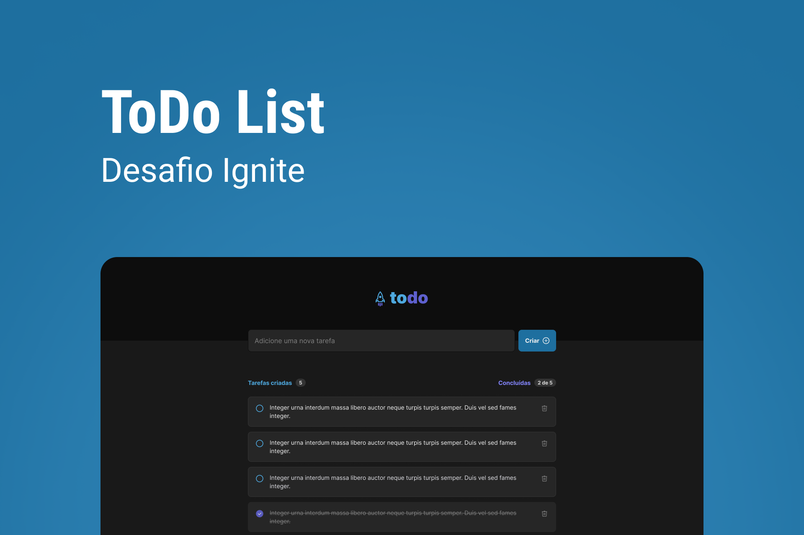

<div align='center'>
  
</div>

<h1 align='center'>
ToDo List
</h1>

<h4 align='center'>
Desafio 1 - Ignite 2022 🚀
</h4>

 # 💻 Projeto
 
Aplicação de controle de tarefas no estilo to-do list, que contém as seguintes funcionalidades:

- Adicionar uma nova tarefa
- Marcar e desmarcar uma tarefa como concluída
- Remover uma tarefa da listagem
- Mostrar o progresso de conclusão das tarefas

A aplicação foi desenvolvida com React + Typescript e como desafio do módulo 1 do bootcamp Ignite - 2022. 

O Projeto também foi desenvolvido do total zero, apenas seguindo o layout proposto na plataforma do Figma, seguindo arrisca todos os paramentros de cores, tamanho das fontes, espaçamento e estados em que cada elemento possa assumir na aplicação.
 
 # 🧪 Tecnologias

Esse projeto foi desenvolvido com as seguintes principais tecnologias:
- [ReactJS](https://pt-br.reactjs.org/);
- [ViteJS](https://vitejs.dev/);
- [Typescript](https://www.typescriptlang.org/);

# 🚀 Como executar

Clone o projeto e acesse a pasta do mesmo.

```bash
$ git clone https://github.com/rogerrm95/coffee-delivery.git
$ cd coffee-delivery
```
Para iniciá-lo, siga os passos abaixo:
```bash
# Instalar as dependências
$ npm install
# Iniciar o projeto
$ npm start
```
O app estará disponível no seu browser pelo endereço http://localhost:5173.

# 🎨 Layout
Você pode visualizar o layout do projeto através do link abaixo:
- [Layout Web](https://www.figma.com/file/bMOCJC3OlsmxAAIQsBpNpn/ToDo-List-(Copy)) (Lembrando que você precisa ter uma conta no Figma).

# 📃 License
[MIT](https://choosealicense.com/licenses/mit/)